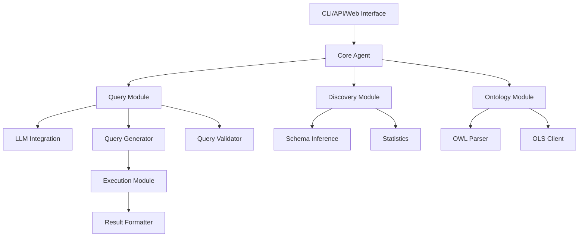
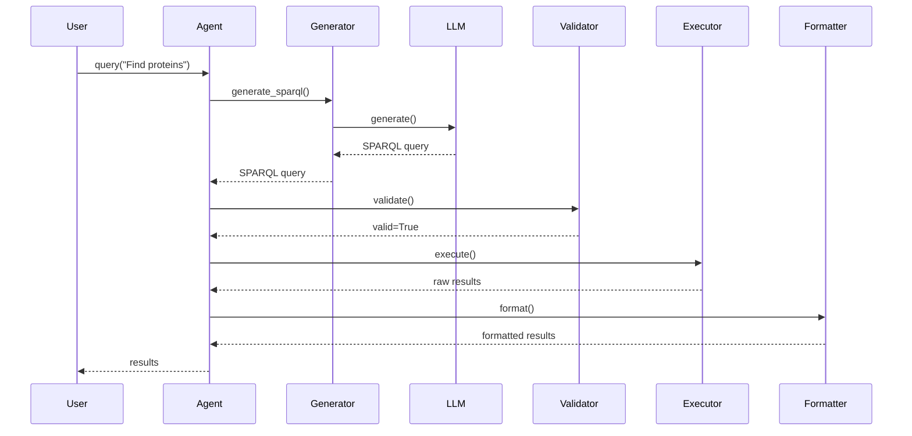
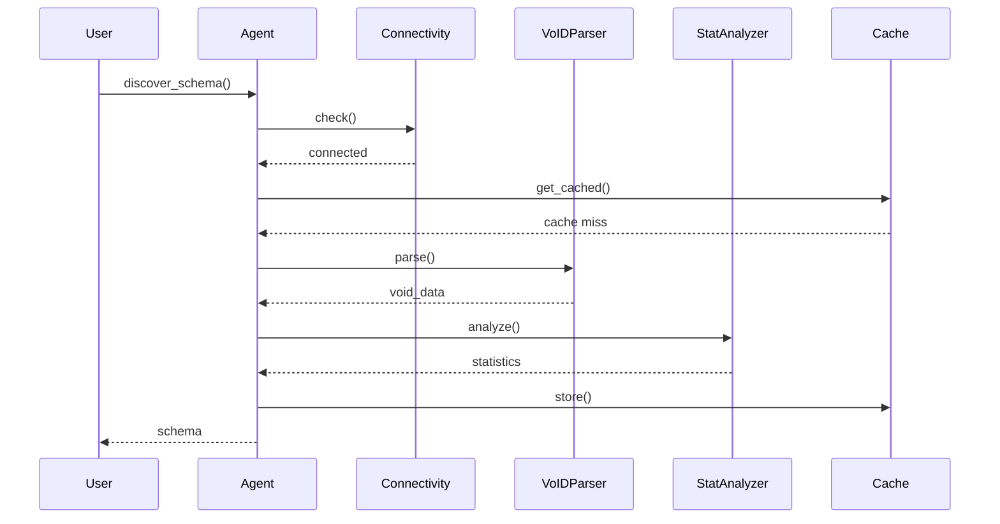
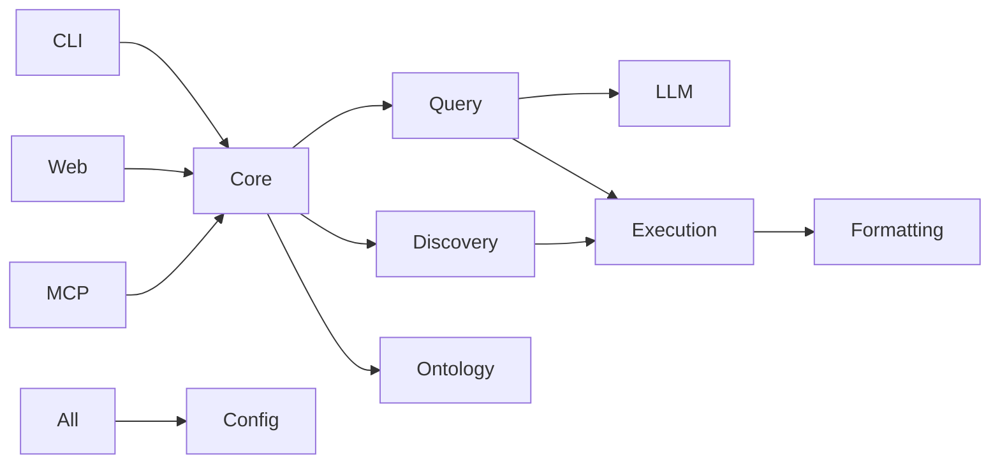

# Architecture

SPARQL Agent follows a modular, layered architecture for maintainability and extensibility.

## System Overview



## Architectural Principles

1. **Separation of Concerns**: Each module has a single, well-defined responsibility
2. **Interface-Based Design**: Modules interact through abstract interfaces
3. **Dependency Injection**: Dependencies injected rather than hard-coded
4. **Extensibility**: Easy to add new LLM providers, endpoints, formatters
5. **Testability**: All components independently testable

## Layer Architecture

### Layer 1: Interface Layer

**Purpose**: User interaction and API exposure

**Components**:
- `cli/`: Command-line interface
- `web/`: REST API and web UI
- `mcp/`: Model Context Protocol server

**Technologies**:
- Click (CLI framework)
- FastAPI (Web framework)
- WebSockets (Real-time communication)

### Layer 2: Core Layer

**Purpose**: Business logic and orchestration

**Components**:
- `core/base.py`: Abstract base classes
- `core/types.py`: Type definitions
- `core/exceptions.py`: Custom exceptions

**Key Classes**:
```python
class SPARQLAgent:
    """Main agent orchestrating all operations"""
    def query(query: str) -> List[Dict]
    def discover_schema() -> Dict
    def validate_query(sparql: str) -> bool
```

### Layer 3: Service Layer

**Purpose**: Domain-specific logic

#### Query Module (`query/`)

- `generator.py`: SPARQL query generation
- `validator.py`: Query validation
- `prompt_engine.py`: LLM prompt management
- `intent_parser.py`: Natural language understanding
- `ontology_generator.py`: Ontology-aware generation

#### Discovery Module (`discovery/`)

- `connectivity.py`: Endpoint connectivity checking
- `statistics.py`: Statistical analysis
- `capabilities.py`: Capability detection

#### Schema Module (`schema/`)

- `schema_inference.py`: Schema discovery
- `void_parser.py`: VoID parsing
- `shex_parser.py`: ShEx parsing
- `validators.py`: Data validation

#### Ontology Module (`ontology/`)

- `ols_client.py`: OLS4 integration
- `owl_parser.py`: OWL ontology parsing
- `ontology_mapper.py`: Term mapping

#### LLM Module (`llm/`)

- `client.py`: Abstract LLM client
- `anthropic_provider.py`: Anthropic Claude
- `openai_provider.py`: OpenAI GPT

### Layer 4: Execution Layer

**Purpose**: Query execution and result handling

**Components**:
- `execution/executor.py`: Query execution
- `execution/validator.py`: Result validation
- `execution/error_handler.py`: Error handling
- `formatting/`: Result formatting

### Layer 5: Infrastructure Layer

**Purpose**: Cross-cutting concerns

**Components**:
- `config/`: Configuration management
- `cache/`: Caching strategies
- `logging/`: Logging infrastructure

## Core Design Patterns

### 1. Strategy Pattern

Query generation strategies:

```python
class QueryGenerator:
    def __init__(self, strategy: str = "auto"):
        self.strategy = self._create_strategy(strategy)

    def _create_strategy(self, strategy: str):
        strategies = {
            "template": TemplateStrategy(),
            "llm": LLMStrategy(),
            "hybrid": HybridStrategy(),
            "auto": AutoStrategy()
        }
        return strategies[strategy]

    def generate(self, query: str) -> str:
        return self.strategy.generate(query)
```

### 2. Factory Pattern

LLM provider factory:

```python
class LLMProviderFactory:
    @staticmethod
    def create(provider: str, **kwargs) -> LLMProvider:
        providers = {
            "anthropic": AnthropicClient,
            "openai": OpenAIClient,
            "local": LocalClient
        }
        return providers[provider](**kwargs)
```

### 3. Observer Pattern

Query execution monitoring:

```python
class QueryExecutor:
    def __init__(self):
        self.observers = []

    def attach(self, observer):
        self.observers.append(observer)

    def notify(self, event):
        for observer in self.observers:
            observer.update(event)

    def execute(self, query):
        self.notify({"type": "start"})
        results = self._execute(query)
        self.notify({"type": "complete", "results": results})
```

### 4. Adapter Pattern

Endpoint adapters:

```python
class SPARQLEndpointAdapter:
    """Adapts different SPARQL endpoint interfaces"""
    def query(self, sparql: str) -> List[Dict]:
        pass

class UniProtAdapter(SPARQLEndpointAdapter):
    def query(self, sparql: str) -> List[Dict]:
        # UniProt-specific logic
        pass
```

### 5. Chain of Responsibility

Query processing pipeline:

```python
class QueryHandler:
    def __init__(self, next_handler=None):
        self.next_handler = next_handler

    def handle(self, query):
        if self.can_handle(query):
            return self.process(query)
        elif self.next_handler:
            return self.next_handler.handle(query)
```

## Data Flow

### Query Execution Flow



### Schema Discovery Flow



## Module Dependencies



## Error Handling Strategy

### Exception Hierarchy

```python
SPARQLAgentError
├── ConfigurationError
├── EndpointError
│   ├── ConnectionError
│   └── TimeoutError
├── QueryError
│   ├── ValidationError
│   ├── GenerationError
│   └── ExecutionError
├── LLMError
│   ├── APIError
│   └── RateLimitError
└── SchemaError
    ├── ParsingError
    └── InferenceError
```

### Error Handling Flow

```python
try:
    results = agent.query("Find proteins")
except ValidationError as e:
    # Query syntax error
    logger.error(f"Invalid query: {e}")
    raise
except TimeoutError as e:
    # Query timeout
    logger.warning(f"Query timeout: {e}")
    return retry_with_smaller_limit()
except LLMError as e:
    # LLM API error
    logger.error(f"LLM error: {e}")
    return fallback_to_template()
```

## Configuration Management

### Configuration Hierarchy

```
1. Default values (code)
2. Config file (~/.sparql-agent/config.yaml)
3. Environment variables
4. Profile settings
5. Command-line arguments
6. Programmatic configuration
```

### Configuration Object

```python
@dataclass
class Config:
    llm_provider: str = "anthropic"
    llm_model: str = "claude-3-5-sonnet-20241022"
    default_endpoint: str = "https://sparql.uniprot.org/sparql"
    timeout: int = 30
    cache_enabled: bool = True

    @classmethod
    def from_file(cls, path: str) -> "Config":
        """Load from YAML file"""
        pass

    @classmethod
    def from_env(cls) -> "Config":
        """Load from environment variables"""
        pass
```

## Caching Strategy

### Multi-Level Cache

```python
class CacheManager:
    def __init__(self):
        self.l1_cache = MemoryCache()  # Fast, small
        self.l2_cache = RedisCache()   # Medium, shared
        self.l3_cache = FileCache()    # Slow, persistent

    def get(self, key):
        return (
            self.l1_cache.get(key) or
            self.l2_cache.get(key) or
            self.l3_cache.get(key)
        )
```

## Performance Considerations

### Query Optimization

1. **Template Reuse**: Cache common query patterns
2. **Connection Pooling**: Reuse HTTP connections
3. **Parallel Execution**: Execute independent queries in parallel
4. **Result Streaming**: Stream large result sets
5. **Lazy Loading**: Load data on demand

### Scalability

- **Horizontal**: Run multiple MCP/Web servers
- **Vertical**: Connection pooling, async I/O
- **Caching**: Redis for shared cache
- **Queue**: Background processing for batch jobs

## Security Architecture

### Authentication & Authorization

```python
class AuthMiddleware:
    def __init__(self, api_keys: List[str]):
        self.api_keys = api_keys

    async def authenticate(self, request):
        api_key = request.headers.get("X-API-Key")
        if api_key not in self.api_keys:
            raise AuthenticationError()
```

### Query Validation

```python
class SecurityValidator:
    BLOCKED_PATTERNS = ["DELETE", "INSERT", "DROP"]

    def validate(self, query: str) -> bool:
        for pattern in self.BLOCKED_PATTERNS:
            if pattern in query.upper():
                raise SecurityError(f"Blocked pattern: {pattern}")
```

## Testing Strategy

### Test Pyramid

```
        ╱────────╲      10% E2E Tests
       ╱──────────╲     30% Integration Tests
      ╱────────────╲    60% Unit Tests
```

### Test Organization

```
tests/
├── unit/           # Fast, isolated tests
├── integration/    # Module integration tests
├── e2e/            # End-to-end tests
└── performance/    # Performance benchmarks
```

## Deployment Architecture

### Docker Deployment

```yaml
services:
  sparql-agent-web:
    image: sparql-agent:latest
    command: sparql-agent-server
    ports:
      - "8000:8000"

  sparql-agent-mcp:
    image: sparql-agent:latest
    command: sparql-agent-mcp
    ports:
      - "3000:3000"

  redis:
    image: redis:alpine

  prometheus:
    image: prom/prometheus

  grafana:
    image: grafana/grafana
```

## Monitoring & Observability

### Metrics

- Query execution time
- LLM API call count
- Cache hit rate
- Error rates
- Endpoint availability

### Logging

```python
import structlog

logger = structlog.get_logger()

logger.info(
    "query_executed",
    query=query,
    duration=duration,
    results=len(results)
)
```

## Future Architecture

### Planned Enhancements

1. **GraphQL API**: Alternative to REST
2. **gRPC Support**: High-performance RPC
3. **Event Streaming**: Kafka/RabbitMQ integration
4. **Vector Search**: Semantic query search
5. **Query Optimization**: Cost-based optimizer

## References

- [Clean Architecture](https://blog.cleancoder.com/uncle-bob/2012/08/13/the-clean-architecture.html)
- [Domain-Driven Design](https://martinfowler.com/bliki/DomainDrivenDesign.html)
- [Microservices Patterns](https://microservices.io/patterns/index.html)
