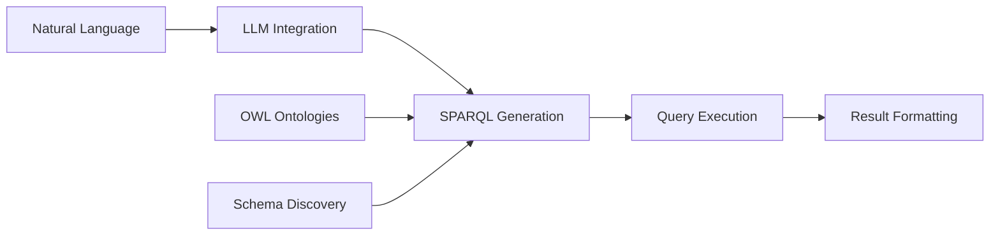
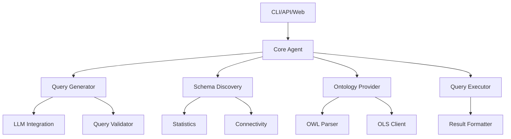

# SPARQL Agent

An intelligent SPARQL query agent with OWL ontology support and LLM integration for semantic web querying and knowledge graph exploration.

## Overview

SPARQL Agent is a comprehensive Python framework that combines the power of SPARQL querying with Large Language Models (LLMs) and OWL ontology reasoning. It provides an intelligent interface for interacting with RDF knowledge graphs, automatic query generation, and schema discovery.



## Key Features

### 🔍 Intelligent Query Generation

Transform natural language questions into precise SPARQL queries using state-of-the-art LLMs:

- Support for Anthropic Claude and OpenAI GPT models
- Context-aware query generation with ontology knowledge
- Automatic query optimization and validation

### 🦉 OWL Ontology Support

Full support for OWL ontologies with reasoning capabilities:

- Load ontologies from files or URLs
- Integration with EBI OLS4 for biomedical ontologies
- Automatic class and property extraction
- Reasoning support via owlready2

### 🌐 Schema Discovery

Automatically discover and analyze RDF/OWL schema structures:

- Endpoint capability detection
- VoID (Vocabulary of Interlinked Datasets) parsing
- ShEx (Shape Expressions) validation
- Statistical analysis and profiling

### 🔗 Federation Support

Query across multiple SPARQL endpoints:

- Federated query generation
- Cross-dataset integration
- Automatic endpoint selection

### 🖥️ Multiple Interfaces

Access SPARQL Agent through your preferred interface:

- **CLI**: Powerful command-line interface
- **Python API**: Programmatic access for integration
- **Web API**: RESTful API with OpenAPI documentation
- **MCP**: Model Context Protocol for AI agent workflows
- **Interactive Shell**: Rich, interactive query environment

## Quick Start

### Installation

=== "UV (Recommended)"

    ```bash
    # Install UV
    curl -LsSf https://astral.sh/uv/install.sh | sh

    # Install SPARQL Agent
    uv add sparql-agent
    ```

=== "pip"

    ```bash
    pip install sparql-agent
    ```

=== "From Source"

    ```bash
    git clone https://github.com/david4096/sparql-agent.git
    cd sparql-agent
    uv sync
    ```

### First Query

=== "CLI"

    ```bash
    uv run sparql-agent query \
      "Find all proteins related to cancer" \
      --endpoint https://sparql.uniprot.org/sparql
    ```

=== "Python API"

    ```python
    from sparql_agent import SPARQLAgent

    agent = SPARQLAgent(
        endpoint="https://sparql.uniprot.org/sparql",
        llm_provider="anthropic"
    )

    results = agent.query("Find all proteins related to cancer")
    print(results)
    ```

=== "Interactive Shell"

    ```bash
    uv run python -m sparql_agent.cli.interactive

    # In the shell:
    sparql> endpoint https://sparql.uniprot.org/sparql
    sparql> query Find all proteins related to cancer
    ```

## Use Cases

### Biomedical Research

Query UniProt, ChEMBL, and other biomedical knowledge graphs:

```python
from sparql_agent import SPARQLAgent

agent = SPARQLAgent(endpoint="https://sparql.uniprot.org/sparql")

# Find proteins associated with a disease
proteins = agent.query(
    "Find human proteins associated with Alzheimer's disease"
)

# Get drug-target interactions
interactions = agent.query(
    "What drugs target proteins in the EGFR pathway?"
)
```

### Knowledge Graph Exploration

Discover and navigate Wikidata, DBpedia, and custom knowledge graphs:

```python
# Query Wikidata
agent = SPARQLAgent(endpoint="https://query.wikidata.org/sparql")

# Find Nobel Prize winners
winners = agent.query(
    "List all Nobel Prize winners in Physics after 2000"
)
```

### Ontology-Driven Queries

Use OWL ontologies to generate semantically rich queries:

```python
from sparql_agent.ontology import OWLParser

# Load ontology
parser = OWLParser("http://purl.obolibrary.org/obo/go.owl")

# Use ontology context for queries
agent = SPARQLAgent(
    endpoint="https://sparql.uniprot.org/sparql",
    ontology=parser
)

results = agent.query(
    "Find proteins with GO term 'DNA repair'"
)
```

## Architecture

SPARQL Agent follows a modular architecture with clear separation of concerns:



### Core Modules

- **core**: Base abstractions and agent logic
- **discovery**: Schema discovery and endpoint analysis
- **schema**: VoID, ShEx, and metadata inference
- **ontology**: OWL parsing and OLS4 integration
- **llm**: LLM provider integrations (Anthropic, OpenAI)
- **query**: SPARQL generation, validation, and optimization
- **execution**: Query execution and error handling
- **formatting**: Result serialization and visualization
- **mcp**: Model Context Protocol server
- **cli**: Command-line interface
- **web**: REST API and web UI

## Next Steps

- [Installation Guide](installation.md) - Detailed installation instructions
- [Quick Start](quickstart.md) - Get started in 5 minutes
- [CLI Reference](cli.md) - Complete command-line documentation
- [Python API](api.md) - Programmatic usage guide
- [Tutorials](tutorials/tutorial-basic.md) - Step-by-step guides

## Community & Support

- **GitHub**: [Report issues](https://github.com/david4096/sparql-agent/issues)
- **Documentation**: [Full documentation](https://github.com/david4096/sparql-agent)
- **Contributing**: See our [contribution guidelines](contributing.md)

## License

SPARQL Agent is released under the MIT License. See [LICENSE](license.md) for details.
